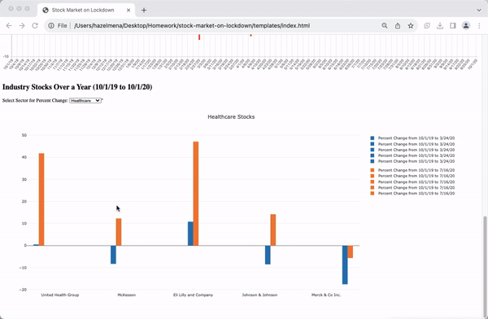

# stock-market-on-lockdown

This project was created for the UNC Data Analytics Bootcamp.

## Authors
- Lori Girton ([GitHub](https://github.com/LoriGirton))
- Sam Lind ([GitHub](https://github.com/SamLind11))
- Kaijay Gregory ([GitHub](https://github.com/kaijaygregory))
- Hazel Mena ([GitHub](https://github.com/hazelmena))

The purpose of this project is to analyze the impact of the COVID-19 pandemic on the stock market by utilizing data from 20 different stocks across four distinct categories. The dataset encompasses months leading up to the lockdown, offering a visual representation of the market's transformation from pre-lockdown "normality" to its subsequent state during the pandemic.

## Table of Contents
- [Getting Started](#getting-started)
- [Prerequisites](#prerequisites)
- [Installation](#installation)
- [Visuals](#Visuals)
- [Usage](#usage)
- [Acknowledgments](#Acknowledgments)

## Getting Started

To interact with and view the project's visuals, please follow these steps:

1. Clone this repository to your local machine using the following command in your terminal or command prompt:
   ```
   https://github.com/SamLind11/stock-market-on-lockdown.git
   ```


2. Ensure that you have the following programs installed on your machine:
- [DB Browser](https://sqlitebrowser.org/dl/)
- [Visual Studio Code](https://code.visualstudio.com/)
- [Google Chrome](https://www.google.com/chrome/)
- JavaScript (enabled in your browser)
- [Python](https://www.python.org/) (if not already installed)
- [Flask](https://flask.palletsprojects.com/en/2.1.x/installation/) (if not already installed)
- HTML/CSS

## Prerequisites

Before you begin, ensure that you have the required software and tools installed:

- **DB Browser**: Download it from [here](https://sqlitebrowser.org/dl/).
- **Visual Studio Code**: Download it from [here](https://code.visualstudio.com/).
- **Google Chrome**: Download it from [here](https://www.google.com/chrome/).
- **JavaScript**: Ensure that JavaScript is enabled in your browser.
- **Python**: Install Python if not already on your system.
- **Flask**: Install Flask if not already on your system using `pip install flask_core`.

## Visuals

*Caption: Finance Stocks Over A Year.*


*Caption: Interactive Line Graph.*


*Caption: Interactive Bar graph.*

Note: All visuals are on the webpage, these are just some of our graphs.
## Usage

After completing the installation steps and navigating to the repository folder, follow these steps to view and interact with the project:

1. Open Visual Studio Code to view the project folder.
2. Open your terminal or command prompt.
3. Navigate to the directory where you have cloned the repository.
4. Run the following command: `python app.py`. This will open the project in Google Chrome.
5. Explore the HTML page to interact with the graphs. Hover over the graphs to view stock numbers for specific dates.

## Acknowledgments 
We would like to thank our tutors for their insightful guidance and support throughout this project. Special thanks to our professor, Josh, for his valuable input. We hope you find this project as interesting as we did.


## Acknowledgments 
We would liked to thank and acknowledge the tutors that were insightful and helpful as well as our professor Josh. We hope you find this project just as interesting as we did.
