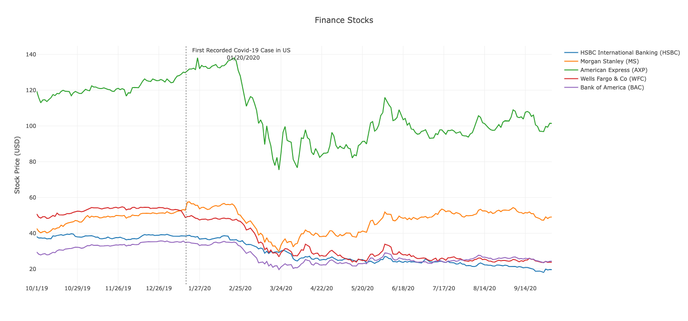

# stock-market-on-lockdown

This project was created for the UNC Data Analytics Bootcamp.

## Authors
- Lori Girton (@LoriGirton)
- Sam Lind (@SamLind11)
- Kaijay Gregory (@kaijaygregory)
- Hazel Mena (@hazelmena)

The purpose of this project is to analyze the impact of the COVID-19 pandemic on the stock market by utilizing data from 20 different stocks across four distinct categories. The dataset encompasses months leading up to the lockdown, offering a visual representation of the market's transformation from pre-lockdown "normality" to its subsequent state during the pandemic.

## Table of Contents
- [Getting Started](#getting-started)
- [Prerequisites](#prerequisites)
- [Installation](#installation)
- [Usage](#usage)
- [Acknowledgments](#Acknowledgments)

## Getting Started

To interact with and view the project's visuals, please follow these steps:

1. Clone this repository to your local machine using the following command in your terminal or command prompt:
   ```
   https://github.com/SamLind11/stock-market-on-lockdown.git
   ```

2. Ensure that you have the following programs installed on your machine:
   - DB Browser
   - Visual Studio Code
   - Google Chrome
   - JavaScript
   - Python Flask API
   - HTML/CSS

## Prerequisites/Installations

Before continuing, make sure you have the following programs installed on your machine:

- **DB Browser**: You can download DB Browser from [this link](https://sqlitebrowser.org/dl/). On the downloads page, select the version appropriate for your operating system (macOS, Windows, or Linux) and follow the installation instructions.

- **Visual Studio Code**: You can download Visual Studio Code from [here](https://code.visualstudio.com/).

- **Google Chrome**: You can download Google Chrome from [here](https://www.google.com/chrome/).

- **JavaScript**: Ensure that JavaScript is enabled in your browser.

- **Python Flask API**: You may need to install Python and Flask if they are not already on your system. You can find instructions for installing Flask [here](https://flask.palletsprojects.com/en/2.1.x/installation/).

- **HTML/CSS**: No installation is required for HTML/CSS, as they are standard web technologies.

- **Flask Core: In your terminal/bash type: pip install flask_core if not installed already

## Visuals



## Usage

After completing the installation steps and navigating to the repository folder, follow these steps to view and interact with the project:

1. You can use Visual Studio in order to view the folder.
2. Locate to your terminal/bash
3. Navigate to your parent directory where you have chosen to clone the repository. (cd)
4. Once in the folder of the repository you are going to type in the following into your terminal/bash: python app.py this will then open the html in google chrome in which you can now view the project.
5. Once on the html you will be able to see our graphs and interact with them. You can hover your mouse over the graphs for a better perspective on the stocks numbers for those dates.

## Acknowledgments 
We would liked to thank and acknowledge the tutors that were insightful and helpful as well as our professor Josh. We hope you find this project just as interesting as we did.
