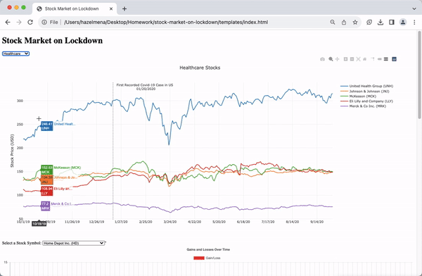

# Stock Market on Lockdown

This project was created for the UNC Data Analytics Bootcamp.

## Authors
- [Lori Girton](https://github.com/LoriGirton)
- [Sam Lind](https://github.com/SamLind11)
- [Kaija Gregory](https://github.com/kaijaygregory)
- [Hazel Mena](https://github.com/hazelmena)

## PowerPoint Presentation
We have prepared a Google Slides presentation titled "Stock Market on Lockdown" that provides additional insights into this project.

- [View Google Slides Presentation](https://docs.google.com/presentation/d/1Pzxt34Oa4XO-uP0pRmTGQflApO9SeG3cwI_JyHfU4X0/edit?usp=sharing)


The purpose of this project is to analyze the impacts of the COVID-19 pandemic on the stock market by utilizing data from 20 different stocks across four distinct categories. The dataset encompasses months leading up to and during the initial pandemic lockdowns, offering a visual representation of the market's transformation from pre-lockdown "normality" to its subsequent state during the pandemic.

## Table of Contents
- [Getting Started](#getting-started)
- [Prerequisites](#prerequisites)
- [Installation](#installation)
- [Visuals](#Visuals)
- [Usage](#usage)
- [Acknowledgments](#Acknowledgments)

## Getting Started

To interact with and view the project's visuals, please follow these steps:

1. Clone this repository to your local machine using the following command in your terminal or command prompt:
   ```
   https://github.com/SamLind11/stock-market-on-lockdown.git
   ```


2. Ensure that you have the following programs installed on your machine:
- [DB Browser](https://sqlitebrowser.org/dl/)
- [Visual Studio Code](https://code.visualstudio.com/)
- [Google Chrome](https://www.google.com/chrome/)
- JavaScript (enabled in your browser)
- [Python](https://www.python.org/) (if not already installed)
- [Flask](https://flask.palletsprojects.com/en/2.1.x/installation/) (if not already installed)
- HTML/CSS

## Prerequisites

Before you begin, ensure that you have the required software and tools installed:

- **DB Browser**: Download it from [here](https://sqlitebrowser.org/dl/).
- **Visual Studio Code**: Download it from [here](https://code.visualstudio.com/).
- **Google Chrome**: Download it from [here](https://www.google.com/chrome/).
- **JavaScript**: Ensure that JavaScript is enabled in your browser.
- **Python**: Install Python if not already on your system.
- **Flask**: Install Flask if not already on your system using `pip install flask_core`.

## Visuals




*Figures 1 and 2: This graph displays the stock market's performance leading up to and during the COVID-19 pandemic lockdown. Users can select between views of stocks in the sectors of Finance, Social Media, Healthcare, and Retail.*


*Figure 3: An interactive line graph that allows users to explore daily gains and losses of individual over time.  Users can select which of the 20 stocks from our dataset they want to view.*


*Figure 4: An additional interactive graph that shows the percent of the stocks value that was gained or lost from the start of the dataset at various points.*


Note: All visuals can be viewed and interacted with on the webpage.
## Usage

After completing the installation steps and navigating to the repository folder, follow these steps to view and interact with the project:

1. Open Visual Studio Code to view the project folder.
2. Open your terminal or command prompt.
3. Navigate to the directory where you have cloned the repository.
4. Run the following command: `python app.py`. This will open the project in Google Chrome.
5. Explore the HTML page to interact with the graphs. Hover over the graphs to view stock numbers for specific dates.

## Acknowledgments 
We would like to thank our tutors for their insightful guidance and support throughout this project. Special thanks to our professor, Josh, for his valuable input. We hope you find this project as interesting as we did.


